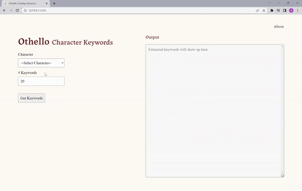

# Othello CharKey Extractor

<b>Othello CharKey Extractor</b> (Othello Character Keywords Extractor) is a web app project for LTCS180. The web app can be used to extract keywords from dialogues of significant characters in Shakespeare's play, <i>Othello</i>.  The identification and extraction of keywords is performed by [KeyBert](https://maartengr.github.io/KeyBERT/). Read more in the 'About' page of web app.

## Accesssing/Running Othello CharKey Extractor Web App
<b>Othello CharKey Extractor</b> is a web app that uses Flask.

To access/run the Flask app locally:
1. Download or clone this repository
2. Open the folder of the downloaded respository in a terminal
3. Run `pip install -r requirements.txt` to install libraries needed to run <b>Othello CharKey Extractor</b>.
4. Set the 'FLASK_APP' enviornment variable:
    - For Linux or Mac:
        `export FLASK_APP=app.py`
    - For Windows:
        `setx FLASK_APP "app.py"`
5. Run Flask App with `flask run`
    - A web address something of the form 'http://127.0.0.1:5000/' should appear in a bit. (The address may differ for you.) Copy and paste the address into a browser.
6. Wa-la! You should now be able to see <b>Othello CharKey Extractor</b> running! Go ahead and explore the web app. 